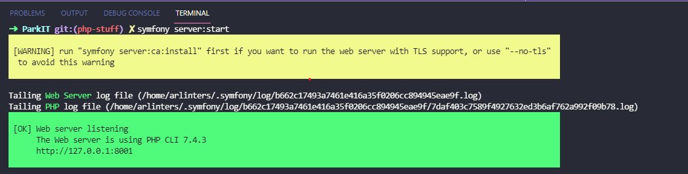
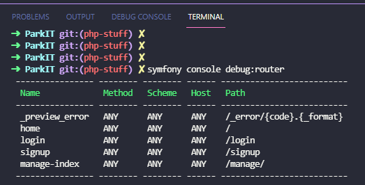

# Set Up
## Pre-Requirements
- PHP Composer
	- [Installer Link](https://getcomposer.org/download/)
- PHP 7.4
- [Symfony Binary](#installing-symfony-binary) 

1. `composer install`
	- There will need to be additional setup to get the database connected. The connection details will be added to .env

2. `docker compose up`
	- This will start the mysql db container. The database "main" should be created as well. 
	- The credentials for the database if you need to troubleshoot are declared in the [Docker Compose yaml](./docker-compose.yaml) at the root of the project.

3. `smyfony console doctrine:migrations:migrate`
	- Applies the existing migrations (in `./src/Migrations`) to the database.
3. `symfony server:start`

# Symfony Quick Overview
This is a MVC based framework that will help us organize our code. There is a [binary](#installing-symfony-binary) available that can make troubleshooting routes and other configuration settings easier when needed.

## [Symfony Documentation](https://symfony.com/doc/current/index.html)

## Folders
Here are the most important areas:
-	`src`
	- Contains the logic. The key folder for now is the Controller folder. This contains the logic for when requests are made. [Additional Reading](https://symfony.com/doc/current/controller.html).

	- Entity & Repository folders are empty, but are there if we want to use an ORM for interacting with the DB. Might not be needed, we could probably write our own SQL queries.

	- Ignore the Kernel.php :)

- `templates`
	- Contains the TWIG templates. It's the templating langauge that symfony uses. It uses  syntax for conditionals or includes and {{}} syntax for outputting content.
	- [Docs](https://twig.symfony.com/doc/3.x/)

- `config`
	- This won't be used near as much, but it contains configuration files for the different packages. If we end up installing a symfony package to tackle a problem, we could tweak the configuration there.

# Installing Symfony Binary
Go to https://symfony.com/download to download the binary. It has a useful dev server and also has a good CLI for checking routes and other useful information.

## Starting the dev server
From the root of this repository, run `symfony start:server`. The output should look like this:

[]

The output can also be useful for debugging.

## Checking Routes
This can be useful, especially if you are editing one of the templates or redirecting a user and need to fetch the route name.

`symfony console debug:router`

[]

